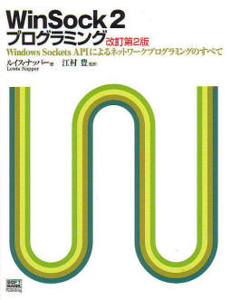

# WinSock2 プログラミング 改訂第２版

**Windows Sockets API によるネットワークプログラミングのすべて**

ルイス・ナッパー (Lewis Napper) 著

江村　豊 監訳

１９９８年 ８月 ２６日　 初版発行  
２００５年 １月 ５日　 改訂第２版第１刷発行

価格：￥５，２００（＋税）

  

**Windowsネットワークプログラミングの標準技法**

WinSock (Windows Sockets) は、Microsoft Windows のネットワークAPI。 ネットワーク機能への単一のインターフェイスをアプリケーションプログラマに提供します。 WinSock がアプリケーションとネットワークの間に位置することで、アプリケーションプログラマが 下位レベルのネットワークプロトコルの詳細を気にかけずにすむようにします。 本書で、WinSock による透過的ネットワークプログラミングを身に付けましょう。

### サンプル

**DataGram**

ごく単純なコンソールデータグラムクライアントとサーバーのアプリケーション。（第2章）

* [dclient.cpp](samples/Ch02/DataGram/DCLIENT.CPP)
* [dserver.cpp](samples/Ch02/DataGram/DSERVER.CPP)

**DataGramV6**

上のIPv6対応版。(第2章）

* [dclientv6.cpp](samples/Ch02/DataGramV6/DCLIENTV6.CPP)
* [dserverv6.cpp](samples/Ch02/DataGramV6/DSERVERV6.CPP)

**GetHTTP**

Webサーバーからファイルを取得するコンソールユーティリティ。（第2章）

* [gethttp.cpp](samples/Ch02/GetHTTP/gethttp.cpp)

**HostInfo**

ホスト情報を取得するのに使用するコンソールユーティリティ。（第2章）

* [hostinfo.c](samples/Ch02/HostInfo/hostinfo.c)

**Stream**

単純なコンソールストリームクライアントとサーバーのアプリケーション。（第2章）

* [client.cpp](samples/Ch02/Stream/CLIENT.CPP)
* [server.cpp](samples/Ch02/Stream/SERVER.CPP)

**StreamV6**

上のIPv6対応版。(第2章）

* [clientv6.cpp](samples/Ch02/StreamV6/CLIENTV6.CPP)
* [serverv6.cpp](samples/Ch02/StreamV6/SERVERV6.CPP)

**WSVer**

WinSock バージョンネゴシエーションサンプル。（第2章）

* [wsedesc.c](samples/Ch02/wsver/WSEDESC.C)
* [wsver.c](samples/Ch02/wsver/WSVER.C)

電子メールの着信チェックする Check Mail サンプルTCP/IP クライアントアプリケーション。（第４章）

* [chekmail.c](samples/Ch04/ChekMail.c)
* [chekmail.h](samples/Ch04/chekmail.h)

**Ping**  

ICMPソケットと生ソケットを使用するPingプログラム。（第５章）

* [ping.c](samples/Ch05/Ping/Ping.c)
* [ping.h](samples/Ch05/Ping/PING.H)

**PingI**

Windows専用のMicrosoft ICMP API を使用するPing専用のプログラム。（第５章）

* [pingi.c](samples/Ch05/PingI/pingi.c)

**SendMail**

Microsoft CSocket クラスを使用して電子メールを送信するTCP/IP クライアントアプリケーション。（第６章）

* [maildlg.cpp](samples/Ch06/SendMail/MailDlg.cpp)
* [maildlg.h](samples/Ch06/SendMail/MailDlg.h)
* [sendmail.cpp](samples/Ch06/SendMail/SendMail.cpp)
* [sendmail.h](samples/Ch06/SendMail/SendMail.h)
* [servdlg.cpp](samples/Ch06/SendMail/ServDlg.cpp)
* [servdlg.h](samples/Ch06/SendMail/ServDlg.h)
* [socketx.cpp](samples/Ch06/SendMail/socketx.cpp)
* [socketx.h](samples/Ch06/SendMail/socketx.h)

**WSTerm**

Microsoft CAsyncSocket クラスを使用して汎用端末ユーティリティを作成するTCP/IPクライアントアプリケーション。（第６章）

* [connectd.cpp](samples/Ch06/WSTERM/CONNECTD.CPP)
* [connectd.h](samples/Ch06/WSTERM/CONNECTD.H)
* [doc.cpp](samples/Ch06/WSTERM/Doc.cpp)
* [doc.h](samples/Ch06/WSTERM/DOC.H)
* [mainfrm.cpp](samples/Ch06/WSTERM/MAINFRM.CPP)
* [mainfrm.h](samples/Ch06/WSTERM/MAINFRM.H)
* [termsock.cpp](samples/Ch06/WSTERM/termsock.cpp)
* [termsock.h](samples/Ch06/WSTERM/termsock.h)
* [view.cpp](samples/Ch06/WSTERM/View.cpp)
* [view.h](samples/Ch06/WSTERM/VIEW.H)
* [wsterm.cpp](samples/Ch06/WSTERM/WSTERM.CPP)
* [wsterm.h](samples/Ch06/WSTERM/WSTERM.H)

**EnumProt**

インストールされているすべてのプロトコルおよびプロトコルチェーンの一覧と、その詳細な情報を表示するサンプルプログラム。（第７章）

* [aftostr.c](samples/Ch07/EnumProt/AFTOSTR.C)
* [enumprot.c](samples/Ch07/EnumProt/ENUMPROT.C)
* [enumprot.h](samples/Ch07/EnumProt/ENUMPROT.H)
* [guidstr.c](samples/Ch07/EnumProt/GUIDSTR.C)
* [protstr.c](samples/Ch07/EnumProt/PROTSTR.C)
* [resource.h](samples/Ch07/EnumProt/RESOURCE.H)

**SelProto**

**汎用プロトコル選択関数とサンプルプログラム。（第2章）**

* [selproto.c](samples/Ch07/SelProto/selproto.c)
* [test.c](samples/Ch07/SelProto/test.c)

**Services**

WinSock 2の名前解決APIを使用して特定のホスト名とサービスに関する情報を表示するMFCサンプルプログラム。（第８章）

* [aftostr.cpp](samples/Ch08/Services/aftostr.cpp)
* [dlg.cpp](samples/Ch08/Services/Dlg.cpp)
* [dlg.h](samples/Ch08/Services/Dlg.h)
* [guids.cpp](samples/Ch08/Services/guids.cpp)
* [protstr.cpp](samples/Ch08/Services/protstr.cpp)
* [services.cpp](samples/Ch08/Services/Services.cpp)
* [services.h](samples/Ch08/Services/Services.h)
* [sockstr.cpp](samples/Ch08/Services/sockstr.cpp)

**GetHTTP2**

HTTPサーバーからファイルを取得し、イベントオブジェクトとWSASelectEvent()を使用して非同期通知を行うコンソールユーティリティ。 （第９章）

* [gethttp2.cpp](samples/Ch09/GETHTTP2/gethttp2.cpp)

**GetHTTP3**

HTTPサーバーからファイルを取得し、WinSock 2の重複I/O関数を使用するコンソールユーティリティ。（第９章）

* [gethttp3.cpp](samples/Ch09/Gethttp3/gethttp3.cpp)

１つのスレッドと非同期通知を使用して、多数のクライアント接続を同時に処理できるHTTPサーバーを作成するサンプルアプリケーション。  
この方式は、多数の接続を同時に処理するのに適しています。（第１０章）

* [httpa.c](samples/Ch10/httpa.c)
* [httpa.h](samples/Ch10/httpa.h)
* [httpui.c](samples/Ch10/httpui.c)
* [httpui.h](samples/Ch10/httpui.h)
* [reqlist.c](samples/Ch10/reqlist.c)

マルチスレッドとブロッキングソケットルーチンを使用して、複数のクライアント接続に処理できるHTTPサーバーを作成するサンプルアプリケーション。（第 １１章）

* [countc.c](samples/Ch11/countc.c)
* [httpmt.c](samples/Ch11/httpmt.c)
* [httpmt.h](samples/Ch11/httpmt.h)
* [httpui.c](samples/Ch11/httpui.c)
* [httpui.h](samples/Ch11/httpui.h)

ソケットアダプタライブラリ。明示的なリンクを使用して、WinSock 1.1とWinSock 2のどちらかを実行時に選択できるようにするソースコードとその関連ファイル。 （第１2章）

* [aeguid.h](samples/Ch12/aeguid.h)
* [dwinsock.c](samples/Ch12/dwinsock.c)
* [dwinsock.h](samples/Ch12/dwinsock.h)

Client 特定のWinSockバージョンに依存しないデータグラムECHOクライアント。WinSock 2が使用できる場合、プログラムは特定のプロトコルにも依存しません。 （第１2章）

* [echoclnt.c](samples/Ch12/client/echoclnt.c)
* [echoclnt.h](samples/Ch12/client/echoclnt.h)

Server 特定のWinSockバージョンに依存しないデータグラムECHOサーバー。WinSock 2が使用できる場合、プログラムは特定のプロトコルにも依存しません。 （第１2章）

* [echoserv.c](samples/Ch12/server/echoserv.c)
* [echoserv.h](samples/Ch12/server/echoserv.h)
* [echoui.c](samples/Ch12/server/echoui.c)
* [socklist.c](samples/Ch12/server/socklist.c)

**全サンプル**
以下アーカイブには、上記で紹介したファイル以外に、リソースファイルやプロジェクトファイルも含まれています。

* [全サンプルのアーカイブ (samples.zip, 872KB)](pub/samples.zip)

**[リンク集](links.htm)**

  

##### by Yutaka Emura / Copyright © [株式会社エムソフト](https://jp.emeditor.com/about/about-emurasoft/)